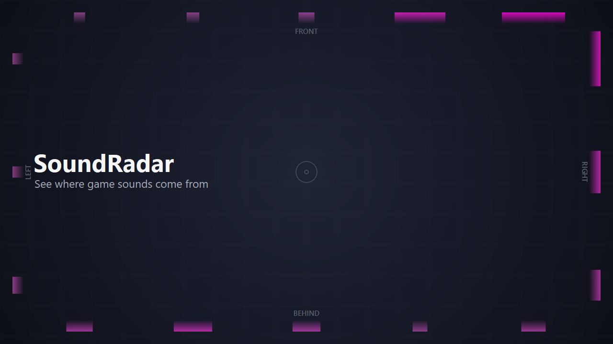

# SoundRadar



> Illustration — the radar lights blocks toward each sound; brighter = louder/closer.

**A free visual surround-sound radar for gamers who can't rely on stereo
hearing.** SoundRadar turns a game's surround audio into a glowing radar around
your screen edge, so the **direction** of in-game sounds can be **seen** instead
of heard. It was built for a player who is deaf in one ear and can't perceive
left/right or front/back by ear — but it's useful for anyone hard of hearing.

The screen border is a compass: **top = in front, bottom = behind, sides =
left/right.** Blocks light up toward a sound's direction and grow bigger and
brighter the louder/closer it is.

 

## Features

- **Real surround radar** — front / back / sides from a 7.1 stream (or a
  left/right radar from stereo).
- **Hearing stays intact** — it mixes everything down to mono for your
  headphones, so a one-eared listener still hears every channel (dialogue
  included).
- **Click-through overlay** — input passes straight to the game; works over
  borderless-windowed games. Not an injected overlay, so it's anti-cheat-safe.
- **Tray app + control panel** — a tray dot to start/pause/quit, and a live
  settings window: sensitivity, **size** and **brightness** (independent — one
  changes how big blocks grow, the other how vivid they are), fade, number of
  blocks, bar thickness, opacity, **colour picker**, **adapt** (favour events
  over constant noise), headphone volume, and **multi-monitor** selection.
  Everything applies live and is saved.
- **Built-in capture check** — a **Check** tab shows a live level bar per
  channel and a one-line verdict (*direction detected* / *collapsed to mono* /
  *silence*), so you can confirm your audio routing is feeding real surround
  without leaving the app.

## Two modes

| | Surround (front/back/sides) | Stereo (left/right only) |
|---|---|---|
| Channels | full 7.1 | 2 |
| Setup | needs a virtual 7.1 device (see SETUP.md) | none — zero audio changes |
| Run | `python run.py --route-audio --device "Voicemeeter VAIO3 Input"` | `python run.py --all-apps` |

See **[SETUP.md](SETUP.md)** for the surround audio setup (on stereo hardware,
front/back requires routing the game through a virtual 7.1 device).

## Install / run (from source)

```sh
pip install -r requirements.txt
python run.py --all-apps          # stereo, no setup, try it instantly
```

Run your game in **borderless windowed** mode so the overlay shows over it.
Open the **tray dot → Settings…** to tune the look.

## How it works

- Captures audio via WASAPI loopback (`soundcard`) — per-app (Process Loopback)
  for the clean stereo mode, or device loopback of a virtual 7.1 device for
  surround.
- Per-channel RMS → directional intensities, with ambient-suppression and an
  event-vs-constant "adapt" stage, smoothed with fast-attack/slow-decay.
- Transparent, always-on-top, click-through Qt overlay (`PySide6`) draws the
  compass blocks.

## License

MIT — free to use, modify, and share. Built with PySide6 (LGPL), soundcard,
numpy, comtypes.
